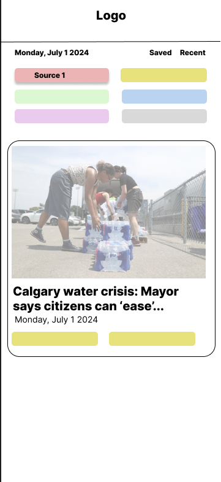

# Project Title
Offbeat - the independent news aggregator

## Overview

A news aggregator website that aims to improve discoverability for small, independent news websites in Canada. The app will essentially contain a news feed that brings together the latest articles from various independent news websites and collectives. It doesn't include a newsreader and instead will direct visitors to the news websites themselves.

### Problem

Apart from the large news outlets in Canada, there are several small regional and national news websites that report on a range of issues but are not as well known. With Bill C-18, these websites could no longer rely on social media to reach their audience. I want to create a hub for independent news so visitors can discover news sources and also find sources they've previously visited but have forgotten about.

### User Profile

This web app is for people interested in independent news and analysis. It's a simple website requiring no sign-ups or account creation.

### Features

- As a user, I want to be able to find the latest news from independent sources
- As a user, I want to be able to save articles to read later
- As a user, I want to be able to find articles that I viewed recently
- As a user, I want to be able to filter articles based on news sources

## Implementation

### Tech Stack

- React
- TypeScript
- Postgres
- Node.js
- Client libraries: 
    - react
    - react-router
    - axios
- Frameworks:
    - tailwindcss
- Server libraries:
    - knex
    - express

### APIs

None

### Sitemap

- Landing page
- Saved Articles
- Recently Viewed

### Mockups

#### Landing Page

### Auth

No Auth needed for this app

## Roadmap

### Iteration 1:

#### Front-end
- Create landing page layout - logo, space for source pills, a news card 
- Read from database and populate sources and card
- Save preferences to local storage
- Animate card flip that reveals article description or summary

#### Back-end
- Create database tables
- Write the RSS reader that will populate the tables

### Iteration 2:

#### Front-end
- Infinite scroll

#### Back-end
- Set up the RSS reader process to run on schedule
 
## Nice-to-haves
- World mood meter plugin
- Add additional news sources that may need web scraping
